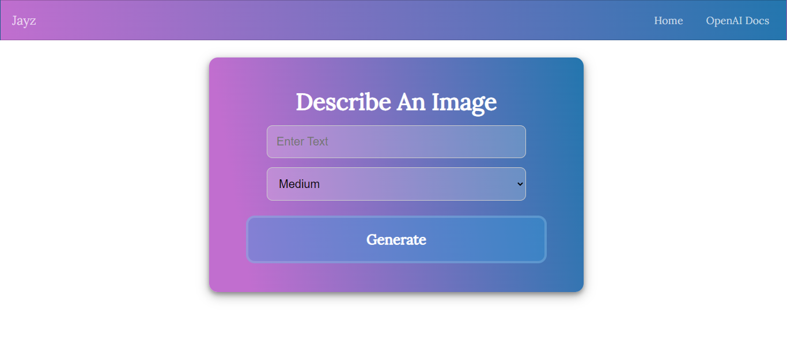

# AI Image Generator WebApp :camera_flash:
 


This is a web app:computer: that can be used to generate images using openAI API\
This web app is made using **Nodejs,Express** for Backend and pure **HTML,CSS,JS** for Frontend
<br></br>

## Build Process :star:

Clone the Git repo:
```
git clone https://github.com/Jayzeen/AI-image-generator-WebApp.git
```
Install The Dependencies
```
npm install
```

### Configure OpenAI API :star:
1. Navigate to [OpenAI Website](https://openai.com/)
2. Follow on screen instructions to set up an API
3. Retrieve the API key
4. Navigate to project root directory and make a **env** file
5. Add the API key with variable name KEY


Run the project :running_man:
```
npm run dev
